# Amazon_Vine_Analysis

Module 16

## Overview

This project analyzes book reviews written by paid Amazon Vine program members compared to reviews written by non-Vine members to determine if bias exists for the paid reviews.

## Results

Before analyzing the Vine review data, the main dataset was broken down into four dataframes/tables. The tables contained customer, review, vine and product data.  

<figcaption align = "center"><b>Review Dataset DataFrame</b></figcaption>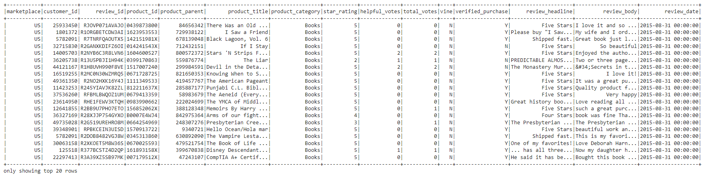 

<figcaption align = "center"><b>Customer DataFrame</b></figcaption>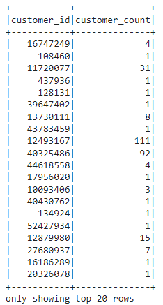 

<figcaption align = "center"><b>Review DataFrame</b></figcaption>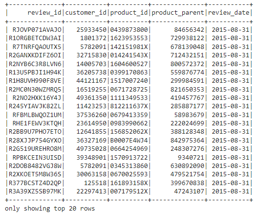 

<figcaption align = "center"><b>Vine DataFrame</b></figcaption>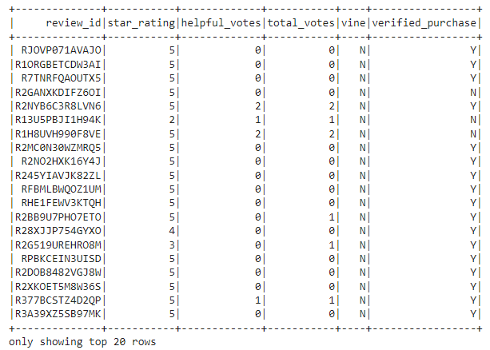 

<figcaption align = "center"><b>Product DataFrame</b></figcaption>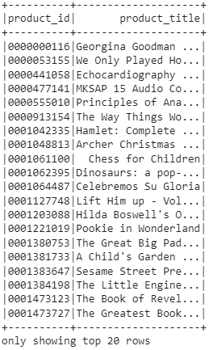

The vine dataframe was used for further analysis.  It was filtered to include total votes greater than 20.  This new dataframe was then filtered to include reviews where the helpful votes divided by total votes were greater than 50% and that data was then divided into vine and non-vine reviewers.  

### Vine Reviews

- There were a total of 5012 paid reviews.

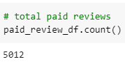 

- Of the paid reviews, 2031 were 5-star.

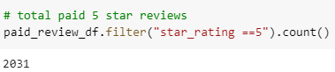 

- The percentage of paid 5-star reviews was ~41%.

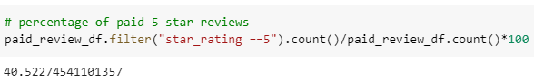 

### Non-Vine Reviews

- There were a total of 109,297 unpaid reviews.

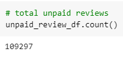 

- Of the unpaid reviews, 49,967 were 5-star.

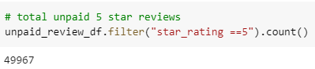 

- The percentage of unpaid 5-star reviews was ~46%.

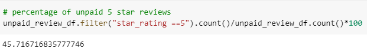 

## Summary

Based on the book dataset examined for this project, it does not appear that the paid reviews are biased.  The amount of 5-star reviews from Vine vs Non-Vine members are very similar, with non-paid reviews coming in at a slightly higher positive rating percentage.

An additional analysis could be completed to further test this hypothesis.  The reviews could be sorted by the product_id or product_titles.  The reviews for paid vs unpaid could be compared per item to see if they received similar star ratings and if any conclusions may be drawn from those results.

### Tools used

- AWS
- Google CoLab
- PySpark
